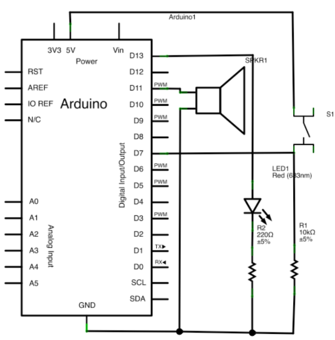

# Project 2: Priority Scheduling
By Luis Daniel Casais Mezquida & Juan Carlos Cebrián Peñuela  
Real Time Systems 22/23  
Bachelor's Degree in Computer Science and Engineering, grp. 89  
Universidad Carlos III de Madrid  

## Project objectives
This Project allows the student to get use with the use of priority schedulers and with real-time operating systems like RTEMS and microcontrollers like Arduino.

## Description
The goal is to build a sound card that plays Pulse Code Modulation audio files (PCM) using an Arduino that gets the data from a i386 with RTEMS connected by the serial port. The program should guarantee the response times for the melodies.  

Two project models must be implemented. The first one allows playing PCM files coded with 4.000 samples per second, where each sample’s size is 1 bit (0 o 1). The second one allows playing PCM files coded with 4.000 samples per second, where each sample’s size is 8 bit (between 0 and 255).  

For a voice telephonic channel where the higest frequency is 3,4 kHz (around 4 KHz) it is enough to obtain 8000 samples per second. Thus, one sample each 125 μsec. This is because the sampling theorem that stands that sampling an electric signal on regular intervals and with frequency that doubles the maximum frequency of the sampled signal, then the samples hold all the information required to rebuild the original signal.  

However for the project we use files with 4000 samples per second (a sample each 250 μsec) because of problems with the transmission speed of the serial port. The reproduction is good enough for the purpose of this project.  

Another important thing is the range of values for each sample. Professional systems use values of 16 bits (between 0 and 2^16) but values of 8 bits (between 0 and 2^8) can also be used with a lower quality. As an extreme example, using the lowest range of 1 bit (between 0 and 1) it is possible to recognize the reproduced song.  

Each project module is divided into two parts: the hardware implementation with the Arduino program that plays the melody and the RTEMS program that take care of sending the audio file on the corresponding deadlines.

## PART 1: File coded with 4000 sample of 1 bit each

### Arduino module
The Arduino module is required to fulfill the following requirements:
- To play on a speaker, sample by sample, a PCM file sended from the i386 by the serial port. Each 1-bit sample is reproduced using the function DisplayWrite to write a 1 or 0 on the corresponding output pin. This process is repeated 4000 times per second.
- To activate or deactivate the “mute” functionality. A hardware button is the interface for this functionality. When the button is pushed, the system goes from normal playback to “mute” (it is done discarding the actual value and playing a 0 value), or the other way around.
- To show the actual playback mode (normal playback or “mute”) by lightning a LED when the “mute” is on.

The circuit schema is the following:  



The Arduino must perform the following tasks:

#### Task 1: Play back the songs received.  
The format of the song is the following:
- Format PCM
- 1 channel (Mono)
- Sampling: 4000 Hz (samples per second)
- 1 bit per sample (each byte incluides 8 samples)

To reproduce a sample, the system receives a byte from the file (read from the internal buffer) and then it should separate the 8 samples to play back each one independently. This is done as following:
```C
digitalWrite(soundPin, (data & mask));
```

Where the mask is a byte with `0`s except a `1` on the position of the sample (mask = $2^{pos}$). Using the AND operation at the bit-level the result is zero if the sample is equal to 0 or bigger than zero if the sample was `1`.  
The algorithm to implement is the following (it must be repeated each 250 μsec):
1. If the mask goes for the 1st bit:
    1. Read a byte from the internal buffer.
2. Play back the corresponding bit of the last read byte using the mask.
3. Change the mask for the one corresponding to the next bit.

#### Task 2: Read the button and change the playback mode.  

This task should sample N times per second if the button is pushed or not (the student should choose the value of N, but it is recommended at least 10 times per second to avoid noises).

In case the button state goes from pushed to non-pushed, the playback mode should change from normal mode to “mute” and vice versa. Remember that “mute” implies to change the actual sample for a zero value but that the bytes from the serial port must be read anyway.

#### Task 3: Show the playback mode using a LED.  

This task should turn on the LED if the system is in “mute” mode or turn it off otherwise. the student should choose the number of times per second to execute this task.  

To do:
1. Design a scheduler (cyclic or priorities) that ensure that the deadlines will be fulfilled, including iterations between tasks.
2. Build an Arduino program that implements the former design and the previous task along with the specified hardware.

**ADVICE:** Instead of using a cycle scheduler (that will be very long due to the difference between periods), it is recommended to implement task 1 using an interruption made with Timer 1 and join task 2 and 3 into one (choosing the same period). This way the same analysis that is valid for priority scheduling will be valid for this.

### RTEMS module
The RTEMS module should do the following tasks:

#### Task 1: Read the audio file and send it to the serial port.  

This task should read 256 bytes of the audio file (opened before) and send them to the Arduino by writing them to the serial port.  
This task has to repeat itself each 512 milliseconds (approx. two times per second).

#### Task 2: Receive commands from the user to pause the play back.  

The task should receive the commands `pause` and `resume`.
- Command `pause`: It is sent using character `0`. When it is sent, the playback task should cease to reproduce the song. (Instead of the music data, zeros will be sent and the read of the audio file should stop).
- Command `resume`: It is sent using character `1`. When it is sent, the playback task should resume playing the song.

The task has to consider that the minimum separation between two readings should be at least 2 seconds, executing the command if there is one.

#### Task 3: Show the reproduction state.
The task should show on the console, the reproduction state with the following messages:
- `"Reproduction paused"` when the play back is paused.
- `"Reproduction resumed"` when the play back is going on. The task should show the state each 5 seconds.  

To do:
1. Design a priority scheduler that ensures deadlines will be fulfilled, including iterations between tasks.
2. Build a RTEMS program that implements the former design and the previous task.

## PART 2: File coded with 4000 samples of 8 bits each

### Arduino Module
The implementation of the Arduino module is the same as the part 1 except for the task 1 and 2 that should be modified as following:

#### Task 1: Play back the songs received.
The format of the song is the following:
- Format PCM
- 1 channel (Mono)
- Sampling: 4000 Hz (samples per second)
- 8 bits per sample (each byte includes 1 sample)

Note that the only have 0 or 5 volts signals to play back the 256 levels of the samples. Thus it is necessary to take advantage of some weird behavior of the speaker using a signal with the highest frequency possible and varying the activity cycle to reproduce the sample.  

This is done as following:
- Configure `Timer 2` to generate a signal (PWM) on the pin `11`. The required configuration is the following:
    - Mode: Fast PWM (bits `WGM2` = `011`)
    - Prescaler: the lowest (bits `CS2` = `001`)
    - Output configuration A: non-inverted output. (bits `COM2A` = `10`)
- Activity cycle: each sample is assigned to the `OCR2A` register.

The algorithm to implement is the following (it must be repeated each 250 μsec):
1. Read a byte from the internal buffer.
2. Assign to `OCR2A` the byte.

### RTEMS module
The implementation of the RTEMS module is the same as the part 1 except for the task 1 that should be modified as following:

#### Task 1: Read the audio file and send it to the serial port
This task should read 256 bytes of the audio file (opened before) and send them to the Arduino by writing them to the serial port.  
This task has to repeat itself each 64 milliseconds (approx. 15 times per second).

### General Recommendations
First perform the design of the schedulers including how to share the state of the systems between the tasks using shared variables. Using the techniques on RTEMS (RMS, priority inheritance, immediate priority ceiling, etc.) and Arduino (interruptions, global mask of interruptions, etc.)

## Installation and Execution

### RTEMS used independently
1. First The Eclipse IDE needs to be installed by executing the following:
    ```
    sudo apt update
    sudo apt install snapd default-jre
    sudo snap install --classic eclipse
    ```
2. Start the eclipse program.
3. Install the following eclipse plugins.  
You need to go to `Help` => `Install new Software...`.  
In the drop down list `Work with` you should select `2019-12 - http://download.eclipse.org/releases/2019-12`. The plugins to install are the following (Use the search bar to find them):
    - C/C++ Autotools support.
    - C/C++ Development Tools.
    - C/C++ GCC Cross Compiler Support.
4. Create a new Cross-compiler C++ project selecting `File` => `New` => `C/C++ Project` and perform the following steps:
    1. Select `C Managed Build`, then `Next`.
    2. Name the project `test_i386`. Also select `Executable` => `Empty Project` and `Cross GCC` then `Next`.
    3. Select both `Debug` and `Release` then `Next`.
    4. Write `i386-rtems5-` inside the `Cross compiler prefix` box. Then select the path `${HOME}/rtems-dev/compiler/arm/5/bin` in the `Cross compiler path` box using the `Browse` button. Finally, press `Finish`.
5. Include the file with the source code:
    1. Open the secondary menu of the project (mouse right click) and select `Import`. Then select `General` => `File System`.
    2. Browse the directory and select the file `rtems/music_rtems_part*.c` (change `*` to the specific part number). Then press `Finish`.
6. Include a new directory for the project that contains the files for the new read-only file system by following the next steps:
    1. Select `File` => `New` => `Folder`. then write rootfs as the name of the directory. Finally, press `Finish`.
    2. Select the directory rootfs. Then, open the secondary menu of the project (mouse right click) and select `Import`. Then select `General` => `File System`.
    3. Browse the directory `rtems/data/` and select the files with extension `.raw`. Then press `Finish`.
7. Modify the options for the compiler and linker following the next steps:
    1. Open the secondary menu of the project (mouse right click) and select Properties. Then, open `C/C++ Build` => `Settings`
    2. Select tab `Build Steps` then, on section `Pre-build steps`, add to the `Command`: box the next commands (all in the same line).
        ```bash
        cd ../rootfs;
        tar cf ../Debug/tarfile *;
        cd ../Debug;
        ${HOME}/rtems-dev/compiler/i386/5/bin/i386-rtems5-ld -r --noinhibit-exec -o tarfile.o -b binary tarfile
        ```
    3. Select `Cross GCC Compiler` => `Miscellaneous` then add at the end of `Other flags`:
        ```
        -B${HOME}/rtems-dev/rtems-lib/i386/5/i386-rtems5/pc386/lib -specs bsp_specs
        ```
    4. Select `Cross GCC Linker` => `Miscellaneous` then add at `Linker flags`:
        ```
        -B${HOME}/rtems-dev/rtems-lib/i386/5/i386-rtems5/pc386/lib -specs bsp_specs -qrtems -Wl,-Ttext,0x00100000 tarfile.o
        ```
    5. Select `Apply and Close`.
8. Configure Eclipse to execute the project using Qemu following the next steps:
    1. Press the `External tools` button and select External Tools Configuration....
    2. Select `Program` and press `New launch` configuration.
    3. On each box write down the following, then press `Run`:
        - Name: `Qemu Debug with stdio pipe`
        - Location: `/usr/bin/qemu-system-i386`
        - Working Directory: `${project_loc}/Debug`
        - Arguments: `-kernel ${project_loc}/Debug/${project_name} -chardev pipe,id=char0,path=/tmp/pipe -serial chardev:char0`
    4. Press the `External tools` button to run again the program.
9. Configure the external music play as following:
    1. Open a text terminal. Install the packet `sox` with the following command:
        ```bash
        sudo apt-get install sox
        ```
    2. Go to the extras directory on the support code and compile the `filter/filter.c` program
        ```bash
        cd filter/
        gcc filter.c -o filter
        ```
    3. Create the following named pipe on the temporal directory.
        ```bash
        mkfifo /tmp/pipe
        ```
    4. Execute the `pipe|play` combined command to play the music.
        ```bash
        ./filter 128 /tmp/pipe | play -t raw -r 4000 -b 8 -c 1 -e unsigned-integer -
        ```
        **NOTE:** For the 8 bits version execute the following command:  
        ```bash
        play -t raw -r 4000 -b 8 -c 1 -e unsigned-integer /tmp/pipe
        ```
10. Execute the command exit on the Qemu window to start the execution:
    ```
    sh> exit
    ```

### Arduino used independently
To use the support code for Arduino independently, the following steps are required:
1. Configure the code of the Arduino framework to increase the serial port buffer to 512 bytes, as following:
    1. Connect the Arduino to the laptop with the Ubuntu 22.04 installed. If using a vmware virtual machine, Connect the Arduino to the virtual machine as well.
    2. Go to Arduino web page and Dowload Arduino IDE 2.0 for linux (zip version).
        ```
        firefox https://downloads.arduino.cc/arduino-ide/arduino-ide_2.0.1_Linux_64bit.zip
        ```
    3. Unzip the Arduino distribution file, get into the directory and start the Arduino IDE from the command line:
        ```bash
        cd $HOME/Downloads
        unzip arduino-ide_2.0.1_Linux_64bit.zip
        cd arduino-ide_2.0.1_Linux_64bit
        ./arduino-ide
        ```
    4. On the Arduino IDE, connect and select the correct Arduino board. A request dialog to install the Arduino board core will appear. Select `YES`.
    5. Once the Arduino board core is installed go to the following directory:
        ```bash
        cd $HOME/.arduino15/packages/Arduino/hardware/avr/1.8.5/cores/Arduino/
        ```
    6. On this directory, open on an editor the file `HardwareSerial.h`. Modify the line `53` to increase the size of the reception buffer from `64` to `512`:
        ```C
        #define SERIAL_RX_BUFFER_SIZE 512
        ```
2. Set up the support hardware for Arduino, as following:
    1. Connect one of the speaker terminals to Arduino digital pin `11`.
    2. Connect the other of the speaker terminals to Arduino ground.
    3. Connect the Arduino to the PC using the USB cable.
3. Ensure the correct permissions to use the serial port:
    1. Include the user account into the `dialout` group.
        ```bash
        sudo usermod -a -G dialout $USER
        ```
4. Load and execute the support code onto the Arduino, as following:
    1. Open the file `music_arduino_part*/music_arduino_part*.ino` (change `*` to the specific part number) using the Arduino IDE 2.0. Compile and load it onto the Arduino to execute it.

### Full system
To use the support code for i386/Arduino combined, the following steps are required:
1. Open the file `music_arduino_part*/music_arduino_part*.ino` (change `*` to the specific part number) using the Arduino IDE 2.0. and comment the following line:
    ```C
    //#define TEST_MODE 1
    ```
2. Connect the Arduino board to the Ubuntu 22.04 virtual machine. Compile and upload the code into the Arduino board.
3. Perform the steps 1-8 from the [RTEMS used independently](#rtems-used-independently) section.
4. Configure the external serial port to connect with the Qemu virtual machine:
    1. Configure the Serial port to maximum speed and raw management:
        ```bash
        sudo stty -F /dev/ttyACM0 raw 115200
        ```
    2. Create the following named pipe on the temporal directory.
        ```
        mkfifo /tmp/pipe
        ```
    3. Copy the content of the pipe into the serial port:
        ```
        cp /tmp/pipe /dev/ttyACM0
        ```
        **NOTE:** This will remain executing until you close the Qemu virtual machine.

5. Execute the command exit on the Qemu window to start the execution:
    ```
    sh> exit
    ```